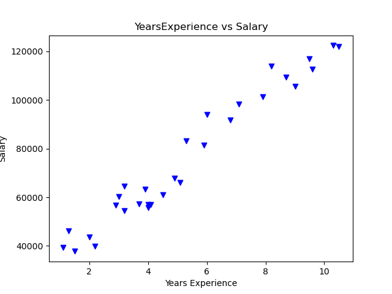

# Linear Regression from Scratch

This repository contains a simple implementation of linear regression using gradient descent in Python. The code is designed to read a dataset, perform linear regression to fit the data, and visualize the results.

## Table of Contents

- [Description](#description)
- [Requirements](#requirements)
- [Usage](#usage)
- [Functions](#functions)
- [Results](#results)
- [License](#license)

## Description

The code reads a dataset (`Salary.csv`) containing `YearsExperience` and `Salary` data. It then performs linear regression using gradient descent to find the best-fitting line for the data. The code also visualizes the data, the regression line, and the loss over iterations.

## Requirements

To run this code, you will need the following Python libraries:

- pandas
- numpy
- matplotlib
- scikit-learn

You can install these libraries using `pip`:

```bash
pip install pandas numpy matplotlib scikit-learn
```

## Usage

1. Clone the repository to your local machine:

```
bash
Copy code
git clone https://github.com/yourusername/linear-regression.git
```

2. Navigate to the project directory:

```
bash
Copy code
cd linear-regression
```

3. Ensure you have the `Salary.csv` file in the same directory as the script. The file should have two columns: `YearsExperience` and `Salary`.
4. Run the script:

```
bash
Copy code
python main.py
```

## Functions

### `y_bar(a, b, x)`

Computes the predicted values given the coefficients `a`, `b`, and the input feature `x`.

### `loss(a, b, x, y, m)`

Computes the mean squared error loss given the coefficients `a`, `b`, the input feature `x`, the target values `y`, and the number of samples `m`.

### `grd(a, b, x, y, m)`

Computes the gradients of the loss with respect to the coefficients `a` and `b`.

### `update(a, b, da, db, LR)`

Updates the coefficients `a` and `b` using the gradients `da`, `db`, and the learning rate `LR`.

### `main()`

Main function that reads the data, initializes parameters, performs gradient descent, and visualizes the results.

## Results

The script will produce the following visualizations:

- A scatter plot of the data (`YearsExperience` vs. `Salary`).
- The loss over iterations for both coefficients (`theta_0` and `theta_1`).
- A scatter plot of the actual data and the regression line.

### Scatter Plot of the Data


 


### Loss over Iterations for `theta_0`


### Loss over Iterations for `theta_1`


### Regression Line


# Linear-Regression-from-Scratch

